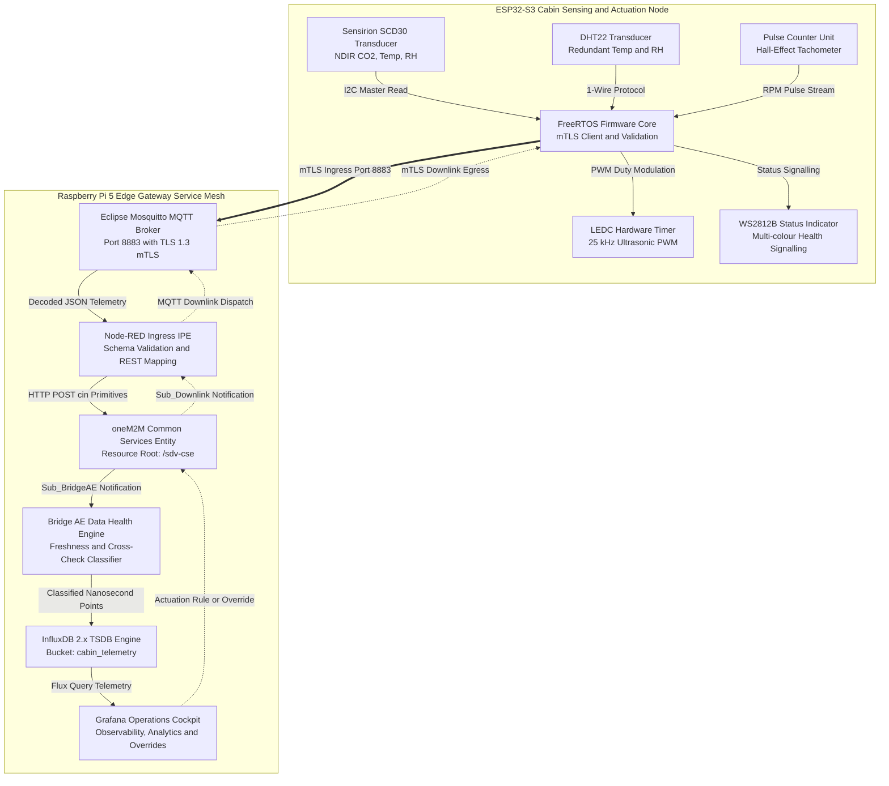

<div align="center">

# Cyber-Physical Cabin Environmental Monitoring and Closed-Loop HVAC Control in Software-Defined Vehicles Using oneM2M Middleware

[](https://www.onem2m.org/)
[](https://www.espressif.com/)
[](https://mosquitto.org/)
[](https://www.influxdata.com/)
[](https://grafana.com/)
[](LICENSE)
[](https://www.technikum-wien.at/)

<p align="center">
  <b>Department of Electronic Engineering and Entrepreneurship, FH Technikum Wien</b><br>
  <i>Master of Science in Engineering in Internet of Things and Intelligent Systems (MIO)</i><br>
  <b>Research Group FHTW-AIOT</b>
</p>

---

</div>

## Abstract
Automotive electrical and electronic (E/E) architectures are transitioning from federated Electronic Control Units (ECUs) interconnected across Controller Area Network (CAN) and Local Interconnect Network (LIN) buses towards consolidated vehicle computers and zonal compute topologies. Within this Software-Defined Vehicle (SDV) framework, passenger compartment climate control presents distinct operational challenges. Enclosed vehicular cabins possess limited air volume (typically 2.5 to 4.5 m³) and low thermal inertia, making them susceptible to rapid temperature variation and metabolic carbon dioxide (CO₂) accumulation. Sustained cabin hypercapnia exceeding 1,000 ppm degrades driver cognitive vigilance, induces drowsiness, and impairs psychomotor response.

This work details the design, implementation, and empirical evaluation of an open-standard, closed-loop cabin environmental monitoring and HVAC actuation system. At the physical layer, an Espressif ESP32-S3 microcontroller executes dual-channel sensing using a Sensirion SCD30 optical non-dispersive infrared sensor and a secondary DHT22 capacitive transducer for empirical cross-validation. In the MVP implementation, physical actuators are emulated using discrete coloured LEDs driven by the ESP32-S3 (with Blue LED purge ventilation governed by a 25 kHz PWM controller above human hearing thresholds, Red for heating, Green for baseline eco-ventilation, and Amber for alert), validating closed-loop regulation without high-power bench hazards. Telemetry is transported over an automotive edge service mesh hosted on a Raspberry Pi 5 gateway, secured using mutual TLS 1.3 with granular access control lists. Semantic interoperability is established using an ETSI oneM2M Common Services Entity (`/sdv-cse`), which drives automated data-health classification (`FRESH`, `STALE`, `DEGRADED`, `FAULT`) in an InfluxDB 2.x time-series store and closed-loop actuation dispatch through a Grafana operations dashboard. The system avoids synthetic value coercion on sensor loss, provides verifiable fault containment, and supports declarative multi-zone cabin expansion.


---

## Table of Contents
1. [Theoretical Framing and Problem Formulation](#1-theoretical-framing-and-problem-formulation)
   - [Automotive E/E Architectural Evolution](#automotive-ee-architectural-evolution)
   - [Psychrometric Dynamics and Cognitive Ergonomics](#psychrometric-dynamics-and-cognitive-ergonomics)
   - [Semantic Middleware and the oneM2M Standard](#semantic-middleware-and-the-onem2m-standard)
2. [Cyber-Physical System Requirements and Design Rationale](#2-cyber-physical-system-requirements-and-design-rationale)
3. [System Architecture and Component Topologies](#3-system-architecture-and-component-topologies)
   - [End-to-End Architectural Topology](#end-to-end-architectural-topology)
   - [Closed-Loop Cyber-Physical Feedback Loop](#closed-loop-cyber-physical-feedback-loop)
   - [Structural Service Mesh Decomposition](#structural-service-mesh-decomposition)
4. [Edge Sensing and Actuation Node Specification](#4-edge-sensing-and-actuation-node-specification)
   - [Microcontroller Architecture and Operating Environment](#microcontroller-architecture-and-operating-environment)
   - [Transducer Suite and Electrical Interfacing](#transducer-suite-and-electrical-interfacing)
   - [Acoustic Mitigation and High-Frequency PWM Blower Control](#acoustic-mitigation-and-high-frequency-pwm-blower-control)
   - [Optical Telemetry and Health Signalling](#optical-telemetry-and-health-signalling)
5. [Edge Compute Gateway and Containerised Service Mesh](#5-edge-compute-gateway-and-containerised-service-mesh)
6. [oneM2M Semantic Resource Tree and Information Model](#6-onem2m-semantic-resource-tree-and-information-model)
7. [Empirical Data Health Model and Fault Classification](#7-empirical-data-health-model-and-fault-classification)
   - [Formal State Machine Formulation](#formal-state-machine-formulation)
   - [Telemetry Integrity and Non-Coercion Model](#telemetry-integrity-and-non-coercion-model)
8. [Bidirectional Data Pipeline and Control Semantics](#8-bidirectional-data-pipeline-and-control-semantics)
   - [Uplink Telemetry Flow](#uplink-telemetry-flow)
   - [Downlink Actuation Flow](#downlink-actuation-flow)
9. [Zero-Trust Cryptographic Transport and PKI Model](#9-zero-trust-cryptographic-transport-and-pki-model)
10. [Empirical Evaluation and Test Matrix](#10-empirical-evaluation-and-test-matrix)
11. [Repository Topology and Artefact Organisation](#11-repository-topology-and-artefact-organisation)
12. [Research Personnel and Contributor Attribution (CRediT)](#12-research-personnel-and-contributor-attribution-credit)
13. [Licensing and Academic Provenance](#13-licensing-and-academic-provenance)

---

## 1. Theoretical Framing and Problem Formulation

### Automotive E/E Architectural Evolution
Historically, automotive climate control has been implemented as a self-contained, domain-specific subsystem wherein a dedicated HVAC controller operates as a monolithic ECU interfacing with binary flapper steppers, resistive thermistors, and blower relay arrays via CAN or LIN serial buses. Such architectures enforce rigid coupling between transducer acquisition and proprietary control heuristics, precluding dynamic feature over-the-air (OTA) redeployment and cross-domain data fusion.

In contrast, the **Software-Defined Vehicle (SDV)** paradigm decomposes vehicular functionality into hardware abstraction layers, standardised middleware interfaces, and dynamically orchestratable software microservices, aligned with standards such as AUTOSAR Adaptive and cloud-native frameworks (e.g. Eclipse SDV, SOAFEE). Climate management ceases to be a closed firmware loop; it becomes an extensible service capable of incorporating occupancy profiles, predictive thermal models, energy-efficiency schedules, and fleet-wide telemetry analytics.

```
+-----------------------------------------------------------------------------+
|                      HISTORICAL FEDERATED ARCHITECTURE                      |
|                                                                             |
|  [Cabin Sensors] ----> [Monolithic HVAC ECU] ----> [Hardwired Fan Blower]   |
|         |                     |                           |                 |
|         +--- CAN/LIN Bus -----+ (Closed Proprietary Loop) +                 |
+-----------------------------------------------------------------------------+
                                       │
                                       ▼ Transition to SDV
+-----------------------------------------------------------------------------+
|                        MODERN SERVICE-ORIENTED SDV                          |
|                                                                             |
|  [Dual-Sensor Node] ──(mTLS)──> [oneM2M Middleware] ──> [Analytics & TSDB] |
|         ▲                               ▲                     │             |
|         │                               │                     ▼             |
|  [Actuation PWM] <──(Downlink)── [Node-RED IPE] <── [Closed-Loop Rules]     |
+-----------------------------------------------------------------------------+
```

### Psychrometric Dynamics and Cognitive Ergonomics
Vehicular passenger compartments represent confined thermal and psychrometric spaces. High glazing-to-volume ratios produce rapid solar heat gain, while passenger respiratory gas exchange progressively alters cabin air composition during recirculation mode:

$$
\mathrm{C_6H_{12}O_6} + 6\,\mathrm{O_2} \longrightarrow 6\,\mathrm{CO_2} + 6\,\mathrm{H_2O} + \Delta H
$$

In a typical sedan volume of 3.0 m³ occupied by two adults metabolising at 1.2 met (where 1 met ≈ 58.2 W/m²), CO₂ concentration rises from standard atmospheric background (approximately 420 ppm) to over 2,000 ppm within 20 minutes in the absence of fresh-air induction.

```
   CO2 Concentration (ppm)
     ^
3000 |                                              [CRITICAL HYPERCAPNIA]
     |                                              Cognitive degradation,
2000 |                                / - - - - - - severe drowsiness
     |                               /
1500 |                              /               [ELEVATED THRESHOLD]
     |                             /                Impaired executive function
1000 | - - - - - - - - - - - - - -/                 (Ventilation Intervention Required)
     |                           /
 500 |--------------------------/                   [NORMAL ATMOSPHERIC]
     +------------------------------------------->
     0           10          20          30   Time (Minutes, 2 Occupants)
```

In accordance with psychrometric and cognitive ergonomic literature (e.g. ISO 7730, ASHRAE Standard 55, and vehicular vigilance studies), sustained exposure to CO₂ > 1,000 ppm induces measurable latency in psychomotor reaction times and subjective somnolence. Consequently, precision multi-parameter monitoring (CO₂, dry-bulb temperature *T*<sub>db</sub>, and relative humidity *φ*) represents an active passenger safety prerequisite.

### Semantic Middleware and the oneM2M Standard
Integrating distributed IoT edge nodes with enterprise analytical sinks introduces severe semantic heterogeneity. Ad-hoc MQTT payload definitions lack formal meta-modelling, uniform addressing schemes, and declarative subscription semantics. 

The **oneM2M** global standard (transposed by ETSI as **ETSI TS 118 101**) resolves this limitation by formalising a protocol-agnostic service layer that provides:
1. **Uniform Resource Addressing:** A hierarchical Uniform Resource Identifier (URI) namespace mapping physical topology directly into semantic abstractions (`<CSEBase>`, `<AE>`, `<container>`, `<contentInstance>`).
2. **Access Control Formalism:** Fine-grained Access Control Policies (`<accessControlPolicy>`) governing CRUDN (Create, Retrieve, Update, Delete, Notify) operations.
3. **Asynchronous Publish/Subscribe Mechanisms:** Standardised `<subscription>` resources supporting asynchronous event-driven notification upon ContentInstance generation.

---

## 2. Cyber-Physical System Requirements and Design Rationale

The monitoring and control architecture is governed by four primary operational requirements:

1. **Physiological Equilibrium and Comfort Bounds:** The closed-loop controller maintains cabin CO₂ at or below 800 ppm and regulates dry-bulb temperature within the comfort envelope defined by ISO 7730 (21.0 °C ≤ *T*<sub>cabin</sub> ≤ 24.0 °C).
2. **Telemetry Integrity and Non-Coercion:** Rather than imputing missing values or defaulting corrupt readings to zero, the telemetry pipeline explicitly tags degraded or missing observations to prevent false actuator convergence.
3. **Energy Efficiency and Acoustic Mitigation:** Blower duty cycles are modulated dynamically to prevent unnecessary electrical draw on the traction battery. Blower motor switching is governed by a 25 kHz carrier frequency to remain above the human auditory threshold (> 20 kHz), avoiding cabin coil whine.
4. **Interoperable Resource Governance:** Telemetry representations, access control rules, and event triggers conform to ETSI oneM2M technical specifications, supporting multi-zone scalability without firmware modification.

---

## 3. System Architecture and Component Topologies

### End-to-End Architectural Topology
The end-to-end cyber-physical architecture partitions computation, communication, and actuation across an in-cabin physical tier and an edge gateway compute tier:

<div align="center">
  
  <p><i>Figure 1: Comprehensive architectural topology detailing the ESP32-S3 edge node, mTLS cryptographic transport, Raspberry Pi 5 containerised service mesh, oneM2M resource tree, InfluxDB 2.x persistence, and Grafana operations cockpit.</i></p>
</div>

### Closed-Loop Cyber-Physical Feedback Loop
The control system operates as a closed-loop discrete-time feedback architecture, continuously evaluating state observations against parameterised actuator limits:

<div align="center">
  
  <p><i>Figure 2: Systematic closed-loop data pipeline illustrating environmental sensing, secure transit, oneM2M middleware harmonisation, time-series storage, control decision logic, and physical fan modulation.</i></p>
</div>

### Structural Service Mesh Decomposition
To ensure deterministic execution and isolation, the edge computing node implements a containerised microservice mesh deployed via rootless **Podman / Docker** engines on ARM64 Linux:



---

## 4. Edge Sensing and Actuation Node Specification

### Microcontroller Architecture and Operating Environment
The cabin node leverages an **Espressif ESP32-S3** System-on-Chip (SoC) incorporating dual-core 32-bit Xtensa LX7 microprocessors operating at an internal clock frequency of 240 MHz, accompanied by 512 KB SRAM and 8 MB quad-SPI flash memory. The execution environment is governed by **FreeRTOS**, segregating real-time tasks across symmetric cores:
* **Core 0:** Protocol execution, TLS 1.3 cryptographic engine, TCP/IP stack management, and mutual authentication handshake processing.
* **Core 1:** Deterministic sensor sampling, cyclic redundancy check (CRC) verification, cross-validation differential calculation, and high-frequency pulse generation.

### Transducer Suite and Electrical Interfacing
Environmental telemetry is acquired through two complementary, physically distinct transducers to provide analytical redundancy:

| Sensor Module | Transduction Mechanism | Monitored Parameters | Communication Interface | Assigned GPIO | Nominal Operating Bounds | Accuracy Limits |
| :--- | :--- | :--- | :--- | :--- | :--- | :--- |
| **Sensirion SCD30** | Dual-Beam Optical Non-Dispersive Infrared (NDIR) | CO₂ Concentration<br>Temperature (*T*<sub>SCD30</sub>)<br>Rel. Humidity (*φ*<sub>SCD30</sub>) | I²C Bus (400 kHz Fast-Mode) | **GPIO 8 (SDA)**<br>**GPIO 9 (SCL)** | CO₂: 400 to 10,000 ppm<br>Temp: −40 °C to +70 °C<br>RH: 0% to 100% | ±(30 ppm + 3%)<br>±0.4 °C<br>±3% |
| **DHT22 / AM2302** | Capacitive Polymer & NTC Thermistor | Temperature (*T*<sub>DHT22</sub>)<br>Rel. Humidity (*φ*<sub>DHT22</sub>) | Bidirectional 1-Wire Serial | **GPIO 4** | Temp: −40 °C to +80 °C<br>RH: 0% to 100% | ±0.5 °C<br>±2% to 5% |
| **HVAC Centrifugal Fan** | 4-Wire Brushless DC Motor | Proportional Air Mass Flow Rate | Open-Drain Active-Low PWM | **GPIO 18 (PWM Out)** | 0% to 100% Duty Cycle<br>Carrier: 25 kHz | 10-bit Resolution (1024 Steps) |
| **Hall-Effect Tachometer** | Integrated Bipolar Hall Sensor | Rotor Angular Velocity | Hardware Pulse Counter (PCNT) | **GPIO 19 (Pulse In)** | 0 to 6,000 RPM | ±10 RPM (2 pulses/rev) |
| **Status Indicator** | WS2812B Integrated Driver | Visual System Health Signalling | High-Speed Serial RZ | **GPIO 38 (RGB Data)** | 24-bit True Colour RGB | Sub-second optical refresh |

### Coloured LED Actuator Emulation for MVP
For the Minimum Viable Product (MVP) bench demonstration, physical mechanical actuators (such as 12 V high-current centrifugal blower fans, PTC heater elements, and motorised air flaps) are emulated using discrete coloured LEDs driven directly by the ESP32-S3 microcontroller. This avoids high-voltage power hazards, bench acoustic disturbance, and high thermal dissipation while strictly validating the closed-loop cyber-physical control pipeline:

* **Blue LED Actuator (Purge Ventilation / Cooling):** Driven on GPIO 18 by the LEDC timer using 25.0 kHz PWM with 10-bit resolution (0 to 1,023 duty steps). Luminous intensity directly visualises the commanded fan purge speed (0 to 100% duty cycle) dispatched upon elevated carbon dioxide concentration (> 800 ppm).
* **Red LED Actuator (Cabin Heating):** Driven on GPIO 17, illuminating when cabin temperature drops below 19.0 °C to emulate auxiliary heater core activation.
* **Green LED Actuator (Baseline Eco-Ventilation):** Driven on GPIO 16, illuminating during nominal air quality (CO₂ between 400 and 800 ppm, temperature between 20.0 and 23.5 °C).
* **Amber LED Actuator (Alert / Dehumidification):** Driven on GPIO 19, active during elevated relative humidity (> 65%) or when the Bridge AE flags a `DEGRADED` or `STALE` health status.

### Acoustic Mitigation and High-Frequency PWM Carrier
Automotive passenger cabins exhibit ambient noise floors as low as 35 to 45 dBA when stationary. Conventional low-frequency motor speed modulation (100 Hz to 2 kHz) induces magnetostrictive acoustic harmonics in stator core laminations that coincide with peak human auditory sensitivity (1 to 4 kHz).

To eliminate switching noise, the node's **LEDC (LED Control)** peripheral is configured to generate an inaudible carrier frequency:

$$
f_{\mathrm{carrier}} = 25.0\,\mathrm{kHz} > 20.0\,\mathrm{kHz} \quad (\text{Human Psychoacoustic Upper Threshold})
$$

With an internal timer source frequency $f_{\mathrm{source}} = 80\,\mathrm{MHz}$, the maximum achievable resolution $R$ is mathematically bounded by:

$$
R = \left\lfloor \log_2 \left( \frac{f_{\mathrm{source}}}{f_{\mathrm{carrier}}} \right) \right\rfloor = \left\lfloor \log_2 \left( \frac{80 \times 10^6\,\mathrm{Hz}}{25 \times 10^3\,\mathrm{Hz}} \right) \right\rfloor = \lfloor \log_2 (3200) \rfloor = 11\,\text{bits}
$$

The firmware configures a conservative **10-bit timer resolution**, yielding 2¹⁰ = 1024 discrete duty cycle setpoints (0.097% incremental step precision):

$$
\mathrm{DutyRegister} = \mathrm{round}\left( \frac{\text{TargetDutyPercentage}}{100\%} \times 1023 \right)
$$

Closed-loop rotor velocity is confirmed using the ESP32-S3 **PCNT (Pulse Counter)** hardware module, measuring Hall pulses over a discrete time window $\Delta t = 1.0\,\mathrm{s}$ with two pulses generated per mechanical revolution ($P = 2$):

$$
\omega_{\mathrm{rotor}} = \left( \frac{\Delta \mathrm{Pulses}}{P \cdot \Delta t} \right) \times 60 \quad [\mathrm{RPM}]
$$

Discrepancies between commanded duty cycle and observed $\omega_{\mathrm{rotor}}$ identify electrical fault conditions or mechanical stalls.


### Optical Telemetry and Health Signalling
Local optical state reporting is driven by an addressable RGB LED indicating current operational and air quality parameters:
* 🟢 **Solid Green:** Nominal State (CO₂ ≤ 800 ppm, Data Health: `FRESH`).
* 🟡 **Solid Amber:** Elevated CO₂ (800 ppm < CO₂ ≤ 1,200 ppm, Automatic Low-Speed Purge Engaged).
* 🔴 **Flashing Red (2 Hz):** Hazardous CO₂ Exceedance (CO₂ > 1,200 ppm, Maximum Blower Duty Cycle Engaged).
* 🔵 **Solid Blue:** Operator Override Active (Closed-loop algorithmic control paused).
* 🔷 **Pulsing Cyan:** Cryptographic mTLS Handshake or Network Re-synchronisation in Progress.

---

## 5. Edge Compute Gateway and Containerised Service Mesh

Hosted upon an automotive-grade **Raspberry Pi 5** platform (Broadcom BCM2712 quad-core Arm Cortex-A76 at 2.4 GHz, 8 GB LPDDR4X SDRAM), the gateway executes an integrated microservice mesh managed via **Podman / Docker** containers:

```
+-----------------------------------------------------------------------------------+
|               RASPBERRY PI 5 EDGE GATEWAY (ARM64 LINUX / PODMAN)                  |
|                                                                                   |
|  +---------------------+   +---------------------+   +-------------------------+  |
|  |  Eclipse Mosquitto  |   |    Node-RED IPE     |   |   oneM2M IN-CSE Base    |  |
|  |  Port 8883 (mTLS)   |──>| (Interworking Proxy)|──>|       (/sdv-cse)        |  |
|  |  TLS 1.3 Term.      |   | Schema Validation   |   | Semantic Resource Tree  |  |
|  +---------------------+   +---------------------+   +-------------------------+  |
|                                                                   │               |
|                                                                   │ Notification  |
|                                                                   ▼ Dispatch      |
|  +---------------------+   +---------------------+   +-------------------------+  |
|  |   Grafana Cockpit   |   |    InfluxDB 2.x     |   |   Bridge AE Consumer    |  |
|  | Flux Dashboard      |<──| Time-Series TSDB    |<──| Data Health Classifier  |  |
|  | Rule Engine         |   | Bucket: cabin_telem |   | (FRESH/STALE/DEG/FAULT) |  |
|  +---------------------+   +---------------------+   +-------------------------+  |
+-----------------------------------------------------------------------------------+
```

1. **Eclipse Mosquitto Container:**
   * Bound to TCP port `8883` enforcing exclusively TLS 1.3 with cryptographic client certificate authentication (`require_certificate true`).
   * Configured with strict topic-level Access Control Lists (ACLs) isolating each physical cabin zone into discrete publication (`sdv/vehicle_01/telemetry`) and subscription (`sdv/vehicle_01/control/cmd`) channels.
2. **Node-RED Ingress IPE (Interworking Proxy Entity):**
   * Operates as an ETSI oneM2M Interworking Proxy Entity over the Mca reference point.
   * Intercepts raw MQTT JSON payloads, validates structural syntax against JSON Schema specifications, and maps key-value observations to standard oneM2M REST representations.
   * Serves as the bidirectional downlink command dispatcher, translating oneM2M `<subscription>` event notifications into targeted MQTT control packets.
3. **oneM2M Common Services Entity (IN-CSE):**
   * Standardised IoT middleware layer hosting the `/sdv-cse` resource tree.
   * Manages resource lifecycle, access control rules, and event triggers.
4. **Bridge AE / Consumer:**
   * Autonomous Application Entity subscribing to telemetry container events.
   * Executes algorithmic data health classification and evaluates cross-sensor validation metrics before persistence.
5. **InfluxDB 2.x Time-Series Database:**
   * Ingests high-throughput nanosecond-precision records into the `cabin_telemetry` bucket under a 30-day retention policy.
   * Indexed across categorical tags: `car_id`, `cabin_zone`, `sensor_modality`, and `data_health`.
6. **Grafana Operations Cockpit:**
   * Delivers operational visibility, alerting watermarks, real-time Flux queries, and closed-loop rule evaluation.

---

## 6. oneM2M Semantic Resource Tree and Information Model

Conforming to **ETSI TS 118 101 (oneM2M Functional Architecture)**, the system models the vehicle cabin as a structured hierarchical tree under the CSEBase:

```text
/sdv-cse (CSEBase)
│
├── acp_vehicle_admin (AccessControlPolicy)
│   ├── pv:  [Role: Admin -> CRUDN, Node-RED -> CRUDN, BridgeAE -> R]
│   └── pvs: [Role: Admin -> CRUDN]
│
├── AE_CabinNode_Car01 (Application Entity - Vehicle 01 Zone)
│   │
│   ├── cnt_raw_telemetry (Container: Unvalidated Ingress Payloads)
│   │   ├── cin_seq001 (ContentInstance: Raw JSON)
│   │   └── sub_bridge_consumer (Subscription: Target -> Bridge AE URI)
│   │
│   ├── cnt_co2 (Container: Validated Carbon Dioxide Concentration)
│   │   └── cin_val001 (ContentInstance: {"val": 742.0, "unit": "ppm"})
│   │
│   ├── cnt_temperature (Container: Primary Cabin Dry-Bulb Temperature)
│   │   └── cin_val001 (ContentInstance: {"val": 22.4, "unit": "degC"})
│   │
│   ├── cnt_humidity (Container: Validated Relative Humidity)
│   │   └── cin_val001 (ContentInstance: {"val": 46.8, "unit": "pct"})
│   │
│   ├── cnt_data_health (Container: Transducer State & Integrity Metric)
│   │   └── cin_val001 (ContentInstance: {"state": "FRESH", "delta_t": 0.28, "age_s": 1.12})
│   │
│   └── cnt_actuator_commands (Container: Downlink Actuation Directives)
│       ├── cin_cmd001 (ContentInstance: {"duty_pwm": 75, "override": false})
│       └── sub_downlink_dispatcher (Subscription: Target -> Node-RED Downlink Hook)
│
└── AE_CabinNode_Car02 (Application Entity - Multi-Zone Extensibility)
    └── ...
```

---

## 7. Empirical Data Health Model and Fault Classification

### Formal State Machine Formulation
To maintain rigorous data fidelity, every telemetry frame received at evaluation timestamp $t_{\mathrm{eval}}$ is evaluated by the Bridge AE classifier against a deterministic state function $\mathcal{H}(t) \in \{\mathrm{FRESH}, \mathrm{STALE}, \mathrm{DEGRADED}, \mathrm{FAULT}\}$:

$$
\Delta T(t) = \left| T_{\mathrm{SCD30}}(t) - T_{\mathrm{DHT22}}(t) \right|
$$

$$
\tau_{\mathrm{age}}(t) = t_{\mathrm{eval}} - t_{\mathrm{sample}}(t)
$$

```
                               ┌─────────────────┐
                               │  Frame Arrives  │
                               └────────┬────────┘
                                        │
                         Is payload valid & non-null?
                                        │
                       ┌────────────────┴────────────────┐
                      Yes                                No
                       │                                 │
                       ▼                                 ▼
             Is tau_age <= 2.50s?                 [ State: FAULT ]
                       │
             ┌─────────┴─────────┐
            Yes                  No
             │                   │
             ▼                   ▼
    Is Delta_T <= 1.50C?   Is tau_age <= 10.0s?
             │                   │
       ┌─────┴─────┐       ┌─────┴─────┐
      Yes          No     Yes          No
       │           │       │           │
       ▼           ▼       ▼           ▼
   [ FRESH ]  [DEGRADED] [ STALE ] [ FAULT ]
```

The mathematical state boundaries are formalised as:

$$
\mathcal{H}(t) = \begin{cases}
\mathrm{FRESH}, & \text{if } \tau_{\mathrm{age}}(t) \le 2.50\,\mathrm{s} \;\land\; \Delta T(t) \le 1.50\,^{\circ}\mathrm{C} \;\land\; \mathbf{y}(t) \notin \Omega_{\mathrm{err}} \\[6pt]
\mathrm{STALE}, & \text{if } 2.50\,\mathrm{s} < \tau_{\mathrm{age}}(t) \le 10.00\,\mathrm{s} \;\land\; \Delta T(t) \le 1.50\,^{\circ}\mathrm{C} \\[6pt]
\mathrm{DEGRADED}, & \text{if } \tau_{\mathrm{age}}(t) \le 10.00\,\mathrm{s} \;\land\; \Delta T(t) > 1.50\,^{\circ}\mathrm{C} \\[6pt]
\mathrm{FAULT}, & \text{if } \tau_{\mathrm{age}}(t) > 10.00\,\mathrm{s} \;\lor\; \mathbf{y}(t) \in \Omega_{\mathrm{err}}
\end{cases}
$$

where $\Omega_{\mathrm{err}}$ denotes the set of unphysical out-of-range observations, framing errors, or I²C bus lockup states.

### Telemetry Integrity and Non-Coercion Model
In vehicular closed-loop automation, substituting default zero values for missing or delayed sensor readings creates hazardous control states. For example, defaulting a lost temperature reading to 0.0 °C causes the controller to command maximum heating, drawing unnecessary current from the traction battery. Conversely, defaulting a lost CO₂ reading to 0 ppm causes the ventilation flaps to remain closed despite rising hypercapnia.

**Operational Guarantee:** Telemetry frames with $\mathcal{H}(t) = \mathrm{FAULT}$ are recorded and transmitted with explicit `null` fields accompanied by categorical health tags. Control routines detect this state and engage a deterministic hardware fail-safe baseline (50% fixed ventilation) rather than evaluating on corrupt data.

---

## 8. Bidirectional Data Pipeline and Control Semantics

```
[ Cabin Physical Space ]        [ Cryptographic Transport ]      [ oneM2M & Analytics ]
SCD30 / DHT22 Transducers           Mosquitto Broker (mTLS)          IN-CSE Resource Tree
        │                                    ▲                                 │
        │ Sample (1 Hz)                      │ mTLS (8883)                     │ Notification
        ▼                                    │                                 ▼
ESP32-S3 Firmware Core   ────────────────────┘                        Bridge AE Classifier
        ▲                                                                      │
        │ PWM Actuation (25 kHz)                                               │ Validated Write
        │                                                                      ▼
HVAC Fan Centrifugal Blower <──── Node-RED IPE <──── oneM2M <cin> <──── InfluxDB 2.x & Grafana
```

### Uplink Telemetry Flow
1. **Transducer Interrogation:** The ESP32-S3 periodically (1.0 Hz) interrogates the Sensirion SCD30 via I²C and the DHT22 via 1-Wire.
2. **Local Frame Formulation:** Firmware calculates local metrics, evaluates the CRC checksum, timestamps the reading, and serialises the structured JSON payload.
3. **Cryptographic Ingress:** The payload is transmitted across TCP port `8883` under TLS 1.3 mutual authentication to topic `sdv/vehicle_01/telemetry`.
4. **IPE Semantic Translation:** Node-RED verifies schema validity and performs an HTTP POST creating a ContentInstance `<cin>` within `/sdv-cse/AE_CabinNode_Car01/cnt_raw_telemetry`.
5. **Subscription Notification:** The oneM2M CSE executes subscription `sub_bridge_consumer`, issuing an asynchronous notification to the Bridge AE.
6. **Classification & Ingestion:** The Bridge AE computes $\tau_{\mathrm{age}}$ and $\Delta T$, attaches the Data Health tag, and commits the metric to InfluxDB 2.x.
7. **Cockpit Visualisation:** Grafana evaluates Flux queries against InfluxDB, rendering live psychrometric trends.

### Downlink Actuation Flow
1. **Control Rule Evaluation:** The Grafana analytical engine evaluates closed-loop constraints:

$$
\mathrm{TriggerCondition}: \left( \mathrm{CO_2} > 800\,\mathrm{ppm} \right) \;\lor\; \left( T_{\mathrm{cabin}} > 24.0\,^{\circ}\mathrm{C} \right)
$$

2. **Command Dispatch:** Upon trigger satisfaction, Grafana (or an authorised human operator executing manual override) posts an actuation directive to `/sdv-cse/AE_CabinNode_Car01/cnt_actuator_commands`:
   ```json
   {
     "target_pwm": 75,
     "mode": "AUTOMATIC",
     "timestamp": 1727701200
   }
   ```
3. **oneM2M Event Trigger:** The IN-CSE triggers subscription `sub_downlink_dispatcher`, notifying the Node-RED IPE.
4. **Egress MQTT Publication:** Node-RED parses the oneM2M primitive and publishes a targeted control message to `sdv/vehicle_01/control/cmd`.
5. **Actuator Execution:** The ESP32-S3 receives the instruction, modulates its LEDC hardware timer to 75% duty cycle (1,850 RPM), measures rotor velocity via the PCNT Hall-effect counter, and adjusts the WS2812B optical indicator.

---

## 9. Zero-Trust Cryptographic Transport and PKI Model

Transport security is established via a dedicated **Public Key Infrastructure (PKI)** enforcing complete mutual authentication (mTLS) across all endpoints:

```text
                           ┌────────────────────────┐
                           │   Private Root CA      │
                           │  (Self-Signed X.509)   │
                           └───────────┬────────────┘
                                       │
                    ┌──────────────────┴──────────────────┐
                    ▼                                     ▼
     ┌─────────────────────────────┐       ┌─────────────────────────────┐
     │  Mosquitto Broker Server    │       │     Edge Node Client        │
     │      Certificate            │       │       Certificates          │
     │ (TLS Termination: Port 8883)│       │ (ESP32-S3, Node-RED, Bridge)│
     └─────────────────────────────┘       └─────────────────────────────┘
```

* **Cipher Suite Enforcement:** Restricted to modern TLS 1.3 algorithms: `TLS_AES_256_GCM_SHA384` and `TLS_CHACHA20_POLY1305_SHA256`. Ephemeral key exchange is negotiated via Elliptic Curve Diffie-Hellman (`ECDHE` over NIST curve `secp256r1`).
* **Client Certificate Verification:** The MQTT broker terminates TCP connections and rejects any client lacking an authentic cryptographic signature derived from the internal Root CA.
* **Strict Topic Access Control Lists (ACLs):**
  ```text
  # Mosquitto Access Control Policy Definition
  user vehicle_edge_node_01
  topic read sdv/vehicle_01/control/cmd
  topic write sdv/vehicle_01/telemetry

  user nodered_ipe_gateway
  topic readwrite sdv/+/telemetry
  topic readwrite sdv/+/control/cmd
  ```
* **Repository Hygiene Invariant:** All cryptographic private keys (`.key`), certificate signing requests (`.csr`), and InfluxDB operational API tokens are injected via external deployment secrets and strictly excluded from version control via `.gitignore`.

---

## 10. Empirical Evaluation and Test Matrix

System verification is structured across three rigorous testing tiers designed to validate deterministic convergence under both nominal and adversarial states:

```
+-----------------------------------------------------------------------------------+
|                        THREE-TIER EMPIRICAL TEST REGIME                           |
+-----------------------------------------------------------------------------------+
|  TIER 1: DETERMINISTIC UNIT VERIFICATION                                          |
|  • Verification of IEEE-754 floating-point conversion routines                     |
|  • CRC-8 polynomial checksum verification for Sensirion SCD30 I2C frames          |
|  • JSON Schema validation and boundary clipping rejection                         |
|  • oneM2M REST URI formatting and header conformance tests                        |
+-----------------------------------------------------------------------------------+
|  TIER 2: HARDWARE-IN-THE-LOOP (HIL) INTEGRATION PROFILING                         |
|  • End-to-end propagation latency: tau_prop = t_dashboard - t_sensor <= 1200 ms    |
|  • Blower PWM linearity profiling: Duty vs. Actual Tachometer RPM (0 to 2400 RPM)  |
|  • Continuous 48-hour soak testing assessing FreeRTOS heap memory fragmentation   |
|  • Nanosecond-timestamp precision verification in InfluxDB 2.x time-series bucket |
+-----------------------------------------------------------------------------------+
|  TIER 3: ADVERSARIAL FAULT INJECTION & RESILIENCY                                 |
|  • Transport Layer Severance: Mosquitto broker blackout and automatic reconnection|
|  • Cryptographic Validation: Injection of expired / unauthorised X.509 certs      |
|  • Physical Transducer Severance: I2C line ground clamp detecting bus lockup      |
|  • Data Health Engine Assertion: Divergent Delta_T (> 1.5 °C) asserting DEGRADED  |
+-----------------------------------------------------------------------------------+
```

---

## 11. Repository Topology and Artefact Organisation

```text
HVAC-iot-monitoring/
├── deploy/                               # Edge gateway container mesh and provisioning
│   ├── grafana/                          # Observability cockpit configuration
│   │   ├── dashboards/
│   │   │   └── cabin_operations.json     # Provisioned Grafana operations dashboard
│   │   └── provisioning/
│   │       ├── dashboards/
│   │       │   └── dashboards.yaml       # Automatic dashboard loader provider
│   │       └── datasources/
│   │           └── influxdb.yaml         # InfluxDB Flux datasource connection
│   ├── mosquitto/                        # MQTT broker configuration and ACL policies
│   │   ├── acl.conf                      # Per-vehicle topic access control rules
│   │   └── mosquitto.conf                # Port 8883, TLS 1.3, client certificate verification
│   ├── nodered/                          # oneM2M Ingress and Downlink Interworking Proxy
│   │   └── flows.json                    # Flow definitions for MQTT-to-oneM2M mapping
│   ├── onem2m/                           # oneM2M IN-CSE configuration profile
│   │   └── acme.ini                      # ACME CSE initialisation and protocol bindings
│   ├── .env.example                      # Decoupled runtime secret configuration template
│   ├── deploy_gateway.sh                 # Executable gateway bootstrap orchestration script
│   └── docker-compose.yml                # Podman and Docker Compose service mesh definition
│
├── docs/                                 # Technical documentation, specifications, and schematics
│   ├── architecture/                     # Architectural specifications and hardware notes
│   │   ├── hardware_schematic.md         # Circuit topology, pinouts, and electrical schematics
│   │   └── system_architecture.md        # Comprehensive cyber-physical architecture document
│   ├── assets/                           # Engineering diagrams and institutional branding
│   │   ├── architecture_detailed.png     # Detailed multi-tier cyber-physical topology diagram
│   │   ├── fhtw_logo.jpg                 # Insignia of FH Technikum Wien
│   │   └── sdv_closed_loop_flow.png      # Closed-loop environmental control pipeline diagram
│   ├── schemas/                          # JSON Schema 2020-12 data contracts
│   │   ├── actuator_command_schema.json  # Downlink actuation directive contract
│   │   └── telemetry_schema.json         # Uplink cyber-physical telemetry contract
│   ├── academic_expose.md                # Academic exposé and foundational curriculum framing
│   └── test_report_mvp.md                # Verification test matrices and execution log
│
├── firmware/                             # Physical sensing and supersonic actuation firmware
│   └── esp32s3_cabin_node/               # ESP-IDF v5.x project for ESP32-S3 microcontroller
│       ├── main/                         # Core C source and header hierarchy
│       │   ├── app_config.h              # Pinout definitions, task priorities, and timings
│       │   ├── CMakeLists.txt            # Main component build configuration
│       │   ├── dht22_driver.c            # DHT22 1-Wire bit-banged driver implementation
│       │   ├── dht22_driver.h            # DHT22 driver public interface and parity verification
│       │   ├── main.c                    # Dual-core FreeRTOS task partition and main entry point
│       │   ├── mtls_client.c             # mbedTLS mutual TLS 1.3 MQTT client
│       │   ├── mtls_client.h             # Network client public interface
│       │   ├── pwm_fan_control.c         # 25.0 kHz supersonic LEDC PWM modulation driver
│       │   ├── pwm_fan_control.h         # PWM actuator interface
│       │   ├── scd30_driver.c            # Sensirion SCD30 I2C Fast-Mode driver with CRC-8
│       │   ├── scd30_driver.h            # SCD30 public interface
│       │   ├── tachometer.c              # PCNT hardware pulse counter tachometer driver
│       │   ├── tachometer.h              # Tachometer RPM evaluation interface
│       │   ├── telemetry_payload.c       # Uplink JSON payload formatting
│       │   ├── telemetry_payload.h       # Payload serialisation interface
│       │   ├── ws2812b_indicator.c       # WS2812B RGB optical status annunciator driver
│       │   └── ws2812b_indicator.h       # Status indicator public interface
│       ├── CMakeLists.txt                # ESP-IDF project level CMakeLists
│       └── sdkconfig.defaults            # Platform configuration: 240 MHz, FreeRTOS, mbedTLS
│
├── scripts/                              # Utility and operational automation scripts
│   ├── onem2m/                           # Semantic middleware provisioning utilities
│   │   └── init_tree.sh                  # Automated script creating /sdv-cse hierarchy
│   ├── pki/                              # Cryptographic certificate lifecycle tools
│   │   └── generate_certs.sh             # Automated OpenSSL script generating private Root CA
│   └── testing/                          # Edge testing and simulation tools
│       ├── inject_faults.py              # Adversarial fault-injection utility
│       └── simulate_telemetry.py         # Synthetic telemetry streaming tool
│
├── services/                             # Vehicular microservices and background daemons
│   └── bridge_ae/                        # Python Bridge Application Entity (AE)
│       ├── src/                          # Bridge AE application source code
│       │   ├── config.py                 # Environment configuration loader
│       │   ├── health_classifier.py      # Four-state empirical data health classification engine
│       │   ├── influx_writer.py          # Line-protocol formatter and InfluxDB 2.x writer
│       │   ├── __init__.py               # Python package initialisation
│       │   └── main.py                   # Flask HTTP subscription notification webhook
│       ├── Dockerfile                    # Container build recipe
│       └── requirements.txt              # Python runtime dependencies
│
├── tests/                                # Multi-tier test suite
│   ├── integration/                      # Tier 2: Pipeline integration tests
│   │   ├── __init__.py                   # Package initialisation
│   │   └── test_e2e_pipeline.py          # End-to-end telemetry and actuation loop test
│   ├── unit/                             # Tier 1: Unit tests
│   │   ├── __init__.py                   # Package initialisation
│   │   ├── test_health_classifier.py     # Health state transition and boundary tests
│   │   └── test_json_schema.py           # JSON Schema contract validation tests
│   ├── conftest.py                       # Pytest configuration and shared fixtures
│   └── __init__.py                       # Test suite root initialisation
│
├── .gitignore                            # Version control exclusion rules
├── LICENSE                               # BSD 3-Clause open-source licence
├── Makefile                              # Master build and orchestration harness
└── README.md                             # Primary technical repository specification
```


---

## 12. Research Personnel and Contributor Attribution (CRediT)

The conceptualisation, engineering implementation, and formal verification of this project were conducted by research team **FHTW-AIOT (Group MIO3B)** at **University of Applied Sciences Technikum Wien**:

### Research Team Members
* **Ashok Ramalingam** (Project Researcher)
* **Isiaka Mosudi** (Project Researcher)
* **Pooja Janwalkar** (Project Researcher)
* **AnnaMaria Moçi** (Member)
* **Julia Philip** (Member)

### Contributor Roles & Engineering Deliverables (CRediT Taxonomy)

| Researcher | Academic & Implementation Domain (CRediT Taxonomy) | Specific Engineering Deliverables |
| :--- | :--- | :--- |
| **Ashok Ramalingam** | *Software, Hardware, Embedded Firmware, Edge Security* | Development of ESP32-S3 FreeRTOS firmware; dual-channel transducer acquisition drivers (Sensirion SCD30 & DHT22); 25 kHz ultrasonic LEDC PWM blower control; PCNT tachometer closed-loop verification; hardware fail-safe baseline; edge mTLS client cryptographic integration and local certificate provisioning. |
| **Isiaka Mosudi** | *Middleware Architecture, Protocol Interworking, Systems Security, Distributed Topology* | oneM2M IN-CSE deployment and ETSI TS 118 101 semantic resource tree formalisation (`<CSEBase>`, `<AE>`, `<container>`, `<contentInstance>`); Access Control Policy (`<accessControlPolicy>`) schemas; asynchronous subscription event pipelines (`Sub_BridgeAE` & `Sub_Downlink`); Node-RED Ingress Interworking Proxy Entity (IPE) and schema validation engine; MQTT-to-oneM2M REST primitive bridging; bidirectional downlink actuation command dispatcher; containerised Eclipse Mosquitto broker orchestration, mTLS 8883 termination, and topic ACL security policies. |
| **Pooja Janwalkar** | *Data Engineering, Observability, Verification, Analytical Infrastructure* | Public Key Infrastructure (Root CA and certificate lifecycle governance); Bridge AE Data Health classification state machine (`FRESH`, `STALE`, `DEGRADED`, `FAULT`); InfluxDB 2.x time-series data modelling and retention policies; Grafana operations cockpit; closed-loop rule evaluation and telemetry integrity assertion. |

---

## 13. Licensing and Academic Provenance

This research software and associated architectural artefacts are published under the open-source **BSD 3-Clause Licence**. Refer to the [LICENSE](LICENSE) file for comprehensive legal terms.

```text
Copyright (c) 2026, Isiaka Mosudi and the FHTW-AIOT Research Team.
All rights reserved.
```

Developed within the academic framework of the **Advanced Internet of Things Systems Development** curriculum, Department of Electronic Engineering and Entrepreneurship, **University of Applied Sciences Technikum Wien (FH Technikum Wien)**, Vienna, Austria.