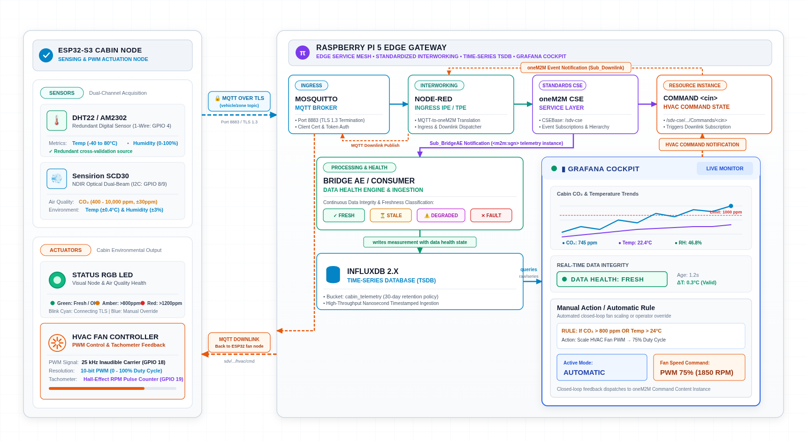
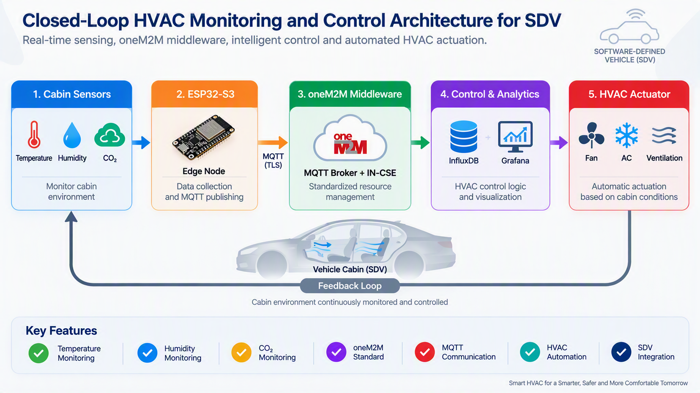

# Advanced Internet of Things Systems Development

## Cyber-Physical Cabin Environmental Monitoring and Closed-Loop HVAC Control in Software-Defined Vehicles Using oneM2M Middleware

**Academic Institution:** University of Applied Sciences Technikum Wien (FH Technikum Wien)  
**Department:** Department of Electronic Engineering and Entrepreneurship  
**Degree Programme:** Master of Science in Engineering in IoT and Intelligent Systems (MIO)  
**Research Cluster:** Distributed Cyber-Physical Systems and Automotive IoT (FHTW-AIOT)  
**Document Classification:** Academic Exposé and Technical Architecture Specification  
**Version / Datum:** 1.2.0-STABLE / 30 September 2026  
**Repository Identifier:** [`imosudi/HVAC-iot-monitoring`](https://github.com/imosudi/HVAC-iot-monitoring)  

---

### Research Team Members
* **Ashok Ramalingam** (Project Researcher)
* **Isiaka Mosudi** (Project Researcher)
* **Pooja Janwalkar** (Project Researcher)
* **AnnaMaria Moçi** (Member)
* **Julia Philip** (Member)

### Contributor Roles and Engineering Deliverables (CRediT Taxonomy)
* **Ashok Ramalingam** (*Software, Hardware, Embedded Firmware, Edge Security*): Embedded FreeRTOS firmware implementation on ESP32-S3; dual-channel transducer acquisition drivers (Sensirion SCD30 I²C and DHT22 1-Wire); 25 kHz LEDC PWM blower modulation; PCNT Hall-effect tachometer closed-loop verification; hardware fail-safe baseline; edge mTLS client cryptographic integration and local certificate provisioning.
* **Isiaka Mosudi** (*Middleware Architecture, Protocol Interworking, Systems Security, Distributed Topology*): oneM2M IN-CSE deployment and ETSI TS 118 101 semantic resource tree formalisation (`<CSEBase>`, `<AE>`, `<container>`, `<contentInstance>`); Access Control Policy (`<accessControlPolicy>`) schemas; asynchronous subscription event pipelines (`Sub_BridgeAE` and `Sub_Downlink`); Node-RED Ingress Interworking Proxy Entity (IPE) and schema validation engine; MQTT-to-oneM2M REST primitive bridging; bidirectional downlink actuation command dispatcher; containerised Eclipse Mosquitto broker orchestration, mTLS 8883 termination, and topic ACL security policies.
* **Pooja Janwalkar** (*Data Engineering, Observability, Verification, Analytical Infrastructure*): Public Key Infrastructure (Root CA and certificate lifecycle governance); Bridge AE Data Health classification state machine (`FRESH`, `STALE`, `DEGRADED`, `FAULT`); InfluxDB 2.x time-series data modelling and retention policies; Grafana operations cockpit; closed-loop rule evaluation and telemetry integrity assertion.

---

### 1. Theoretical Framing, Background, and Motivation
Automotive electrical and electronic (E/E) architectures are transitioning from federated Electronic Control Units (ECUs) interconnected over legacy Controller Area Network (CAN) and Local Interconnect Network (LIN) buses towards consolidated vehicle computers and zonal compute topologies. Within the Software-Defined Vehicle (SDV) framework, this structural transition decouples physical sensing and actuation from application business logic, facilitating dynamic feature deployment, structured telemetry collection, and service-oriented communication.

Cabin environmental regulation presents distinct control requirements within this architecture. Passenger compartments represent confined air volumes (typically 2.5 to 4.5 m³) with low effective thermal inertia. Solar radiation through glazing causes rapid thermal stratification, while passenger metabolic respiration continuously alters the ambient gas mixture. When climate systems run in recirculation mode to conserve thermal energy, carbon dioxide (CO₂) concentrations can increase from atmospheric background levels (approximately 420 ppm) to more than 1,500 to 2,500 ppm within 15 to 30 minutes. In accordance with ISO 7730 and ASHRAE Standard 55, sustained hypercapnia exceeding 1,000 ppm induces drowsiness, increases reaction times, and degrades cognitive vigilance. Maintaining passenger comfort and driver alertness therefore requires closed-loop monitoring and responsive ventilation intervention.

Directly coupling physical environmental transducers to application-level control heuristics introduces inflexible interfaces and inhibits multi-zone expansion. Telemetry must be validated, timestamped, cross-checked across redundant sensing channels, and mapped into a structured semantic model. The oneM2M standard (ETSI TS 118 101) addresses this requirement by providing an open, protocol-agnostic service layer that standardises uniform resource addressing, access policies, and asynchronous publish/subscribe event management.

---

### 2. Cyber-Physical System Requirements and Design Rationale
The monitoring and control architecture is structured around four primary operational requirements:

1. **Physiological Equilibrium and Comfort Bounds:** The closed-loop controller maintains cabin CO₂ at or below 800 ppm and regulates dry-bulb temperature within the comfort envelope defined by ISO 7730 (21.0 °C ≤ *T*cabin ≤ 24.0 °C).
2. **Telemetry Integrity and Non-Coercion:** Rather than imputing missing values or defaulting corrupt readings to zero, the telemetry pipeline explicitly tags degraded or missing observations to prevent false actuator convergence.
3. **Energy Efficiency and Acoustic Mitigation:** Blower duty cycles are modulated dynamically to prevent unnecessary electrical draw on the traction battery. Blower motor switching is governed by a 25 kHz carrier frequency to remain above the human auditory threshold (> 20 kHz), avoiding cabin coil whine.
4. **Interoperable Resource Governance:** Telemetry representations, access control rules, and event triggers conform to ETSI oneM2M technical specifications, supporting multi-zone scalability without firmware modification.

---

### 3. System Architecture and Component Specifications

*Figure 1: Cyber-physical cabin environmental monitoring and closed-loop HVAC control system architecture.*

#### 3.1 ESP32-S3 Cabin Sensing and Actuation Node
The in-cabin physical tier is governed by an Espressif ESP32-S3 SoC (dual-core Xtensa LX7 at 240 MHz, 512 KB SRAM) running FreeRTOS:
* **Transducer Suite:**
  * **Sensirion SCD30:** NDIR optical dual-beam sensor measuring CO₂ (400 to 10,000 ppm, accuracy ±(30 ppm + 3%)), temperature (−40 °C to +70 °C, ±0.4 °C), and relative humidity (0% to 100%, ±3%) over I²C Fast-Mode (400 kHz) on **GPIO 8 (SDA)** and **GPIO 9 (SCL)**.
  * **DHT22 / AM2302:** Digital 1-Wire transducer measuring temperature (−40 °C to +80 °C, ±0.5 °C) and relative humidity (0% to 100%, ±2% to 5%) on **GPIO 4**, establishing a redundant reference channel.
* **Actuation and Visual Subsystems:**
  * **HVAC Centrifugal Blower:** Modulated via LEDC hardware timer generating a 25.0 kHz ultrasonic carrier on **GPIO 18** with 10-bit resolution (1024 discrete steps). The 25 kHz carrier frequency exceeds the human auditory range (> 20 kHz), eliminating acoustic coil whine in the cabin.
  * **Tachometer Feedback:** Dual-pulse Hall-effect sensor connected to the PCNT pulse counter hardware unit on **GPIO 19**, computing actual rotor angular velocity:

$$
\omega_{\mathrm{fan}} = \left( \frac{\Delta \mathrm{Pulses}}{2 \cdot \Delta t} \right) \times 60 \quad [\mathrm{RPM}]
$$

  * **Optical Health Annunciator:** Integrated WS2812B RGB LED on **GPIO 38** signalling:
    * 🟢 *Solid Green:* CO₂ ≤ 800 ppm, Data Health: `FRESH`.
    * 🟡 *Solid Amber:* 800 ppm < CO₂ ≤ 1,200 ppm, Automatic Low-Speed Purge Active.
    * 🔴 *Flashing Red (2 Hz):* CO₂ > 1,200 ppm, Maximum Blower Duty Cycle Engaged.
    * 🔵 *Solid Blue:* Operator Manual Override Active.
    * 🔷 *Pulsing Cyan:* Cryptographic mTLS Handshake or Network Negotiation.

#### 3.2 Raspberry Pi 5 Automotive Edge Gateway
The gateway layer executes a containerised microservice mesh orchestrated via Podman or Docker on ARM64 Linux:
* **Eclipse Mosquitto (MQTT Broker):** Terminates TLS 1.3 on port `8883` with mandatory X.509 client certificate verification and topic ACL enforcement (`sdv/<car_id>/#`).
* **Node-RED Ingress IPE (Interworking Proxy Entity):** Validates incoming JSON syntax against structural JSON Schemas, maps sensor fields into standard oneM2M REST representations over the Mca reference point, and acts as the downlink command dispatcher.
* **oneM2M Common Services Entity (IN-CSE):** Hosts the ETSI-compliant semantic resource hierarchy under `/sdv-cse`, enforces Access Control Policies (`<accessControlPolicy>`), and evaluates event subscriptions (`Sub_BridgeAE` and `Sub_Downlink`).
* **Bridge AE / Consumer:** Autonomous analytical worker evaluating temporal latency $\tau_{\mathrm{age}}$ and cross-validation differential $\Delta T$, applying categorical data health flags.
* **InfluxDB 2.x:** Ingests nanosecond-timestamped metric points into the `cabin_telemetry` bucket under a 30-day retention policy.
* **Grafana Operations Cockpit:** Real-time observability interface rendering psychrometric trends, threshold markers (1,000 ppm reference line), automated rule execution, and manual operator overrides.

---

### 4. Methodological Workflow and Control Semantics

*Figure 2: Systematic closed-loop telemetry and actuation feedback pipeline.*

#### 4.1 Uplink Telemetry Pipeline
1. **Transducer Interrogation:** The ESP32-S3 executes periodic sampling (1.0 Hz) across the Sensirion SCD30 and DHT22.
2. **Local Frame Serialisation:** Firmware evaluates the CRC checksum, timestamps the observation, and serialises the payload into structured JSON.
3. **mTLS Publication:** The frame is transmitted over mutual TLS 1.3 to topic `sdv/vehicle_01/telemetry` on port 8883.
4. **IPE Ingress Validation:** Node-RED validates structural schema adherence, discarding malformed or non-compliant frames.
5. **oneM2M Persistence:** Node-RED issues an HTTP POST creating a ContentInstance `<cin>` within `/sdv-cse/AE_CabinNode_Car01/cnt_raw_telemetry`.
6. **Subscription Dispatch:** The IN-CSE triggers subscription `sub_bridge_consumer`, issuing an asynchronous notification to the Bridge AE.
7. **Health Classification and Commitment:** The Bridge AE evaluates telemetry latency ($\tau_{\mathrm{age}}$) and cross-validation differential ($\Delta T$), appends categorical health metadata, and writes the structured record into InfluxDB 2.x.
8. **Real-Time Visualisation:** Grafana evaluates Flux queries against InfluxDB, updating operational cockpit panels.

#### 4.2 Downlink Actuation Pipeline
9. **Rule Evaluation:** Grafana evaluates closed-loop constraints:

$$
\mathrm{TriggerCondition}: \left( \mathrm{CO_2} > 800\,\mathrm{ppm} \right) \;\lor\; \left( T_{\mathrm{cabin}} > 24.0\,^{\circ}\mathrm{C} \right)
$$

10. **Command Instantiation:** Upon condition fulfillment or manual human operator override, an HTTP POST generates an actuation `<cin>` in `/sdv-cse/AE_CabinNode_Car01/cnt_actuator_commands`.
11. **Subscription Event:** The oneM2M IN-CSE notifies subscription `sub_downlink_dispatcher`.
12. **Egress Dispatch and Actuation:** Node-RED dispatches an MQTT packet to `sdv/vehicle_01/control/cmd`. The ESP32-S3 modulates blower PWM duty cycle to 75% (1,850 RPM), measures tachometer pulses, and updates visual status signalling.

---

### 5. Data Health State Classification
In vehicular closed-loop automation, substituting default zero values for missing or delayed sensor readings creates hazardous control states. For example, defaulting a lost temperature reading to 0.0 °C causes the controller to command maximum heating, imposing unnecessary parasitic load on the traction battery. Conversely, defaulting a lost CO₂ reading to 0 ppm causes the ventilation flaps to remain closed despite rising hypercapnia.

To ensure telemetry fidelity, the Bridge AE classifies all incoming frames using an explicit four-state model based on message latency ($\tau_{\mathrm{age}}$) and inter-sensor temperature divergence ($\Delta T$):

$$
\Delta T(t) = \left| T_{\mathrm{SCD30}}(t) - T_{\mathrm{DHT22}}(t) \right|
$$

$$
\tau_{\mathrm{age}}(t) = t_{\mathrm{eval}} - t_{\mathrm{sample}}(t)
$$

$$
\mathcal{H}(t) = \begin{cases}
\mathrm{FRESH}, & \text{if } \tau_{\mathrm{age}}(t) \le 2.50\,\mathrm{s} \;\land\; \Delta T(t) \le 1.50\,^{\circ}\mathrm{C} \;\land\; \mathbf{y}(t) \notin \Omega_{\mathrm{err}} \\[6pt]
\mathrm{STALE}, & \text{if } 2.50\,\mathrm{s} < \tau_{\mathrm{age}}(t) \le 10.00\,\mathrm{s} \;\land\; \Delta T(t) \le 1.50\,^{\circ}\mathrm{C} \\[6pt]
\mathrm{DEGRADED}, & \text{if } \tau_{\mathrm{age}}(t) \le 10.00\,\mathrm{s} \;\land\; \Delta T(t) > 1.50\,^{\circ}\mathrm{C} \\[6pt]
\mathrm{FAULT}, & \text{if } \tau_{\mathrm{age}}(t) > 10.00\,\mathrm{s} \;\lor\; \mathbf{y}(t) \in \Omega_{\mathrm{err}}
\end{cases}
$$

Under `FAULT` regimes, observations are persisted as `null` with explicit diagnostic annotations. Closed-loop control routines detect this state and engage a deterministic hardware fail-safe baseline (50% fixed ventilation) rather than computing on corrupt data.

---

### 6. Security and Public Key Infrastructure (PKI)
* **X.509 Certificate Chain:** Dedicated private Root CA issues intermediary broker and node certificates. Every communicating entity possesses a unique keypair and certificate.
* **mTLS 1.3 Termination:** Cipher suites are strictly constrained to `TLS_AES_256_GCM_SHA384` and `TLS_CHACHA20_POLY1305_SHA256` with ephemeral Elliptic Curve Diffie-Hellman (`ECDHE`) key negotiation.
* **Topic ACL Isolation:** Node credentials are structurally barred from publishing or subscribing to foreign vehicle namespaces.
* **Decoupled Secret Management:** Cryptographic private keys and InfluxDB access tokens are injected at deployment time through environment variables and excluded from version control.

---

### 7. Empirical Validation and Testing Strategy
Validation is conducted across three testing tiers:

| Testing Tier | Scope and Verification Targets | Pass Criteria |
| :--- | :--- | :--- |
| **Tier 1: Unit Verification** | JSON Schema parsing; SCD30 CRC-8 checksum evaluation; oneM2M URI generation; floating-point conversion accuracy. | Zero parsing exceptions; 100% detection of corrupt checksums. |
| **Tier 2: HIL Integration** | End-to-end hardware-in-the-loop propagation latency: $\tau_{\mathrm{prop}} = t_{\mathrm{dashboard}} - t_{\mathrm{sensor}}$; blower PWM duty cycle linearity; FreeRTOS heap memory profiling over 48 hours. | $\tau_{\mathrm{prop}} \le 1{,}200\,\mathrm{ms}$; linear RPM response (0 to 2,400 RPM); zero heap memory degradation. |
| **Tier 3: Fault Injection** | Network transport blackout; expired or untrusted X.509 client certificate injection; I²C line clamping; rogue client ACL penetration. | Deterministic reconnection within 3.0 s; immediate broker TLS drop on bad cert; `DEGRADED`/`FAULT` flag assertion. |

---

### 8. Conclusion and Future Directions
This investigation demonstrates an operational, standards-compliant cyber-physical architecture for closed-loop cabin environmental monitoring and actuation in Software-Defined Vehicles. Combining dual-transducer edge acquisition with ETSI oneM2M semantic middleware and time-series analytical sinks provides verified data fidelity, acoustic comfort, and active ventilation control. Future work will extend this framework to multi-zone passenger microclimates and integrate predictive thermal comfort models based on ISO 7730 criteria.
